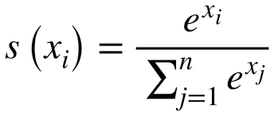

## 🤖 Neural Network Algorithm

### 📖 Definition  
A **Neural Network** is a computational model inspired by the biological brain, composed of layers of interconnected “neurons” (nodes). Each connection has a weight, and each neuron applies an activation function to its weighted inputs to produce an output. Neural networks can learn complex, non‑linear relationships from data.

---

### ✅ Advantages  
- **Universal Function Approximation**  
  Can model virtually any continuous function given enough layers and neurons.  
- **Automatic Feature Learning**  
  Learns hierarchical representations directly from raw data (e.g., images, text).  
- **High Performance on Complex Tasks**  
  State‑of‑the‑art in image recognition, natural language processing, speech synthesis, etc.  
- **Flexible Architectures**  
  Variants like CNNs, RNNs, Transformers suit different data types and sequence lengths.  
- **Scales with Data & Compute**  
  Performance often improves as you increase dataset size and model capacity.

---

### ⚠️ Disadvantages  
- **Data‑Hungry**  
  Requires large labeled datasets to avoid overfitting and reach good accuracy.  
- **Computationally Intensive**  
  Training deep networks demands significant GPU/TPU resources and time.  
- **Opaque (“Black Box”)**  
  Difficult to interpret how internal layers arrive at decisions.  
- **Prone to Overfitting**  
  Many parameters increase risk of memorizing noise without regularization.  
- **Hyperparameter Sensitivity**  
  Requires careful tuning of learning rate, architecture, regularization, batch size, etc.

---

🎯 **Tip**: Choose simpler models (fewer layers/neurons) when data is limited, and apply techniques like dropout, batch normalization, and early stopping to improve generalization.  
---
## 🎯 Generalization in Neural Networks

**Generalization** is a network’s ability to perform well on **unseen data**, not just the examples it was trained on. In other words, a well‑generalized model has truly learned the underlying patterns in the data rather than memorizing noise.

---

### 🔑 Key Points

- **Training vs. Test Performance**  
  - Low **training loss** + low **test/validation loss** ⇒ good generalization.  
  - Low **training loss** + high **test/validation loss** ⇒ overfitting (poor generalization).  
  - High **training loss** ⇒ underfitting (model too simple to generalize).

- **Generalization Error**  
  $$
  \text{Generalization Error}
  = \mathbb{E}_{(x,y)\sim P_{\text{data}}}\bigl[L\bigl(f(x),\,y\bigr)\bigr]
  $$  
  where $L$ is the loss function and $P_{\text{data}}$ is the true data distribution.

- **Why It Matters**  
  - Real‑world data is never identical to the training set.  
  - Good generalization ensures reliable predictions on new, noisy, or shifted data.

---

### 🚀 Improving Generalization

- **Regularization** (L1, L2, dropout)  
- **Early Stopping** based on validation loss  
- **Data Augmentation** (for images, text, etc.)  
- **Cross‑Validation** to select robust hyperparameters  
- **Simpler Architectures** when data is limited  

---

> **Bottom Line**:  
> A neural network generalizes well if its performance on fresh, unseen data is comparably high to its performance during training.  
---
## 🔢 Loss Function in Neural Networks

The **loss function** (or **cost function**) measures how far the network’s predictions $\hat y$ deviate from the true labels $y$. Training aims to **minimize** this loss over all samples.

---

### 📐 Overall Loss

Given a training set $\mathcal{D} = \{(x_i, y_i)\}_{i=1}^N$ and network parameters $\theta$, the average loss is:

$$
L(\theta)
= \frac{1}{N}
\sum_{i=1}^{N}
\ell\bigl(\hat y_i,\,y_i\bigr)
\quad\text{where}\quad
\hat y_i = f(x_i;\,\theta)
$$

- $f(x_i;\theta)$ is the network’s output for input $x_i$.  
- $\ell(\hat y, y)$ is the **sample-wise loss**.

---

### 🔍 Common Sample‑Wise Losses

1. **Mean Squared Error (MSE)**  
   For regression tasks:  
   $$
   \ell_{\text{MSE}}(\hat y, y)
   = \tfrac{1}{2}\,(\hat y - y)^{2}
   $$

2. **Cross‑Entropy Loss (Multiclass Classification)**  
   If $y$ is one‑hot over $C$ classes and $\hat y_c$ is the softmax probability for class $c$:  
   $$
   \ell_{\text{CE}}(\hat y, y)
   = -\sum_{c=1}^{C} y_{c}\,\log \hat y_{c}
   $$

3. **Binary Cross‑Entropy**  
   For binary outputs $y\in\{0,1\}$ and prediction $\hat y\in(0,1)$:  
   $$
   \ell_{\text{BCE}}(\hat y, y)
   = -\bigl[y\,\log \hat y \;+\;(1-y)\,\log(1-\hat y)\bigr]
   $$

---

### 🚀 From Loss to Training

- Compute $L(\theta)$ over the batch or full dataset.  
- Use **backpropagation** to compute $\nabla_{\theta}L(\theta)$.  
- Update parameters via gradient descent (or variants) to **minimize** $L(\theta)$.

---
## 🔹 Softmax Function

**Definition**  
The **Softmax** function converts a vector of raw scores (logits) into a probability distribution over $K$ classes. Each output lies in $(0,1)$ and all outputs sum to 1.

---

### 📐 Formula

Given a logit vector $mathbf{z} = [z_1, z_2, \dots, z_K]$, the Softmax output for class $i$ is:

---

### 🎯 Usage in Classification

1. **Output Layer Activation**  
   In a neural network for multiclass classification, Softmax is applied to the final layer’s logits to produce class probabilities  
   $$hat{\mathbf{y}} = \sigma(\mathbf{z}).
   $$

2. **Prediction**  
   The predicted class is  
   $$arg\max_{i}\,\hat y_i.
   $$

3. **Combined with Cross‑Entropy Loss**  
   Training minimizes the cross‑entropy:  
   $$ell_{\text{CE}}(\hat{\mathbf{y}}, \mathbf{y})
   = -\sum_{i=1}^{K} y_i \,\log(\hat y_i).
   $$

---

### 📊 Numeric Example

Consider logits $\mathbf{z} = [2.0,\,1.0,\,0.1]$:

1. **Exponentials**  
   $$exp(\mathbf{z})
   = [e^{2.0},\,e^{1.0},\,e^{0.1}]
   \approx [7.39,\,2.72,\,1.11].
   $$

2. **Sum**  
   $$7.39 + 2.72 + 1.11 = 11.22.
   $$

3. **Softmax Probabilities**  
   $$hat{\mathbf{y}}
   = \left[\frac{7.39}{11.22},\,\frac{2.72}{11.22},\,\frac{1.11}{11.22}\right]
   \approx [0.659,\,0.242,\,0.099].
   $$

4. **Predicted Class**  
   $$arg\max_{i} \hat y_i = 1.
   $$

---

🎯 **Takeaway**:  
Softmax turns logits into a normalized probability distribution, making it ideal for multiclass classification.  
